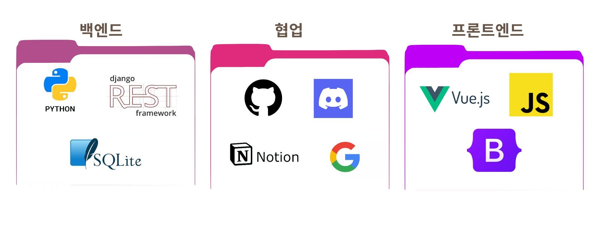
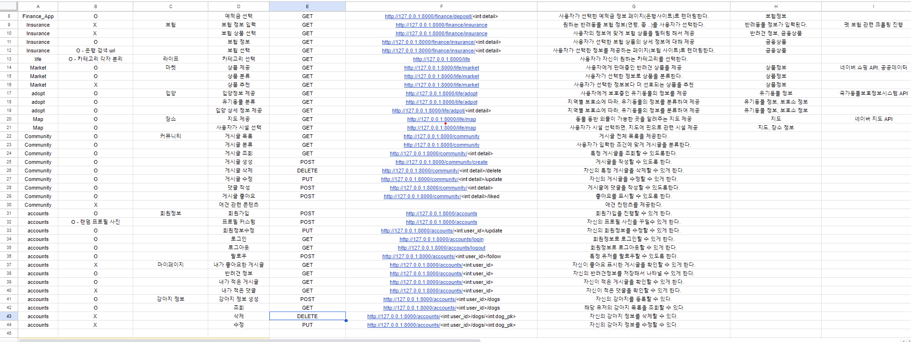
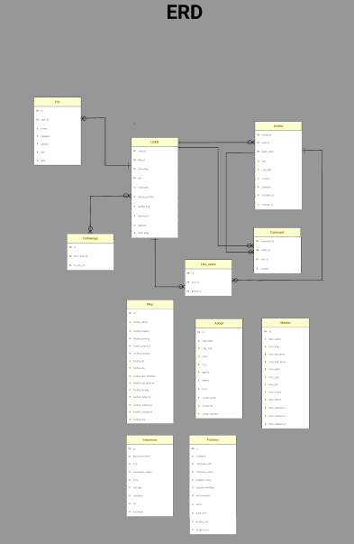
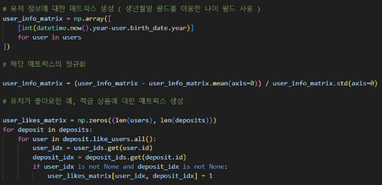
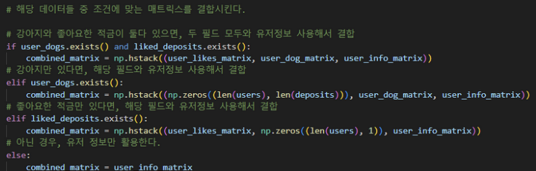
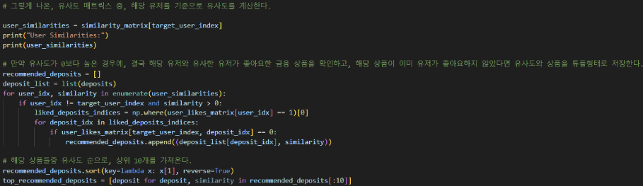

# MUNG_PLAN

> 삼성 청년 소프트웨어 아카데미(SSAFY) 11기 1학기 관통 프로젝트

.png>)

## ✨ 프로젝트 개요

🏷 **프로젝트 이름: MUNG_PLAN**

🗓️ **프로젝트 기간: 2024.05.13 ~ 2024.05.24**

👥 **구성원**
  #### - 팀장 : 김동환
    - 백엔드, 프론트엔드
    - 데이터 수집, 데이터 모델링, 추천 알고리즘 구현
  #### - 팀원 : 이승지
    - 백엔드, 프론트엔드
    - 데이터 수집, 컴포넌트 설계, 디자인

## 기획 의도
**MUNGPLAN**에서 영리한 반려생활을 시작해보세요 !

반려 동물 산업은 꾸준히 성장하고 있음에도 불구하고, 유기견의 수는 줄지 않고 오히려 증가하고 있습니다. 다양한 조사에 따르면, 유기견이 생기는 주요 원인은 통제 불가능한 상황과 금전적인 문제였습니다.

저희 팀은 유기견 증가 문제와 관련해 강아지를 현명하게 키우기 위해 필요한 서비스를 제공하는 프로젝트를 만들고자 하였습니다.

저희는 입양을 망설이는 사람들과 현재 반려동물 양육 중이지만 조금이나마 부담을 갖고 있는 사람들을 페르소나로 설정하였습니다.
유기견 입양부터 강아지 동반 가능 맵, 강아지 마켓, 강아지 커뮤니티, 비상금 마련을 위한 금융까지 통합 플랫폼을 제공하여 대상자들에게 실질적으로 도움이 되는 서비스를 제공하고자 합니다.

## 🛠 기술 스택

## 📝 설계 내용 및 실제 구현 정도

## E-R Diagram

## 예적금 상품 추천 알고리즘
### 코사인 유사도 분석 시스템을 활용한 유사도 기반의 추천 서비스
#### 10000건 가량의 유저와 강아지의 더미데이터를 생성, 922개의 금융 상품과 해당 상품에 대한 좋아요 더미데이터를 생성

---

### 1. 유저 정보에 대한 매트릭스 생성
#### 유저 정보에 대한 매트릭스를 생성하기 위해 생년월일을 기준으로 나이필드를 활용했으며,
#### 유저가 좋아요한 상품과 유저의 강아지에 대해서도 각각 매트릭스를 생성하고 정규화를 진행

### 2. 각 유저 정보에 맞는 조건의 매트릭스와 결합
#### 조건에맞게 분기하여, 해당 유저가 적금과 강아지 데이터를 가지고 있는지 여부를 활용하여 매트릭스를 확정

### 3. 코사인 유사도를 분석해 상위 10개의 상품 선정
#### 해당 매트릭스를 활용하여 현재 유저를 기준으로 유사도를 측정
#### 유사도 매트릭스를 반복하며 현재 유저와 유사도가 존재하는 유저 중, 해당 유저가 관심을 표시한 상품을 가져와 유사도를 표시
#### 이후, 해당 상품들 중 유사도가 높은 순으로 10개를 가져와 데이터를 전송

## 서비스 대표 기능들에 대한 설명
### 1. 랜딩 페이지
- IntersectionObserver 라이브러리를 활용해 사용자의 마우스 움직임에 따라 이벤트를 제공.
- 휠로 오르락내리락하며 페이지 탐색 가능.

### 2. 회원가입 및 로그인
- 회원가입 시 랜덤한 캐릭터 이미지 할당 및 간략한 회원 정보 입력 필수(추천 알고리즘 적용).
- 필수 폼을 작성하지 않으면 경고 문구 출력.

### 3. 프로필 페이지
- 유저와 강아지의 캐릭터 이미지 제공.
- 좋아요한 금융 상품과 게시글 확인 가능.
- 유저 팔로우 기능 제공.

### 4. 입양 페이지
- 동물보호관리시스템의 API를 이용해 6400건의 유기견 데이터 제공.
- 유기견 정보와 보호소 연락처, 검색 링크 제공.
- 필터링 기능으로 유기견 정보 탐색 가능.

#### 5. 지도 페이지
- 네이버맵 API와 지오로케이션 API를 활용해 사용자 위치 기반 지도 제공.
- 중심부 이동 버튼과 반려동물 동반 장소 데이터(약 24000건) 제공.
- 특정 장소의 마커 클릭 시 정보와 링크 제공.

#### 6. 커뮤니티 게시판
- 고민나누기, 중고장터, 동네사람들로 구성된 1300개 더미 데이터.
- 게시글 좋아요, 댓글, 생성, 수정, 삭제 기능.
- 유저 프로필 확인 및 팔로우 기능.

#### 7. 마켓 페이지
- 네이버 쇼핑 검색 API를 활용해 상품을 카테고리별로 구성.
- 상세보기에서 상품 비교와 가격 비교 기능 제공.

#### 8. 금융 페이지
- 보험과 예적금으로 나누어진 금융 상품 정보 제공.
- 11개의 펫 보험과 900개의 예적금 데이터를 필터링 기능과 함께 제공.
- 금융 상품 상세 정보와 은행 페이지 링크 제공.

#### 9. 예적금 추천 서비스
- 코사인 유사도 분석 시스템을 활용한 유사도 기반 추천.
- 10000건의 유저와 강아지 더미 데이터, 922개의 금융 상품 더미 데이터 활용.
- 유저 정보, 좋아요한 상품, 강아지 데이터를 바탕으로 유사도 측정 후 상위 10개의 금융 상품 추천.

## 느낀 점 및 후기
### 김동환
이번 프로젝트에서 저는 데이터 수집, 데이터 모델링, 그리고 추천 알고리즘 구현을 담당했습니다. 데이터를 수집하는 과정에서 다양한 소스로부터 데이터를 확보하는 것이 가장 큰 도전이었습니다. 특히 지도 데이터의 경우, 가공 과정이 어려워 많은 시간동안 고심하고 노력했던 것 같습니다.

데이터 모델링 부분에서는 사용자와 강아지의 다양한 속성을 반영해 유의미한 매트릭스를 구성하는 것이 중요했습니다. 이를 통해 유저의 특성과 관심사를 반영한 맞춤형 추천이 가능하게 되었습니다. 코사인 유사도 분석 시스템을 활용한 추천 알고리즘을 구현하면서, 데이터 정규화와 유사도 계산 과정에서 테스트를 반복했습니다.

또한, Django에서 dj-rest-auth를 사용하다 보니, 값 변경과 같은 커스텀 작업에서 어려움을 겪었습니다. 이를 해결하기 위해 공식 문서와 여러 자료를 참고하며 문제를 해결해 나갔습니다.

이번 프로젝트를 통해 복잡한 데이터를 효과적으로 처리하고, 이를 기반으로 실질적인 가치를 제공하는 시스템을 구축하는 데 큰 보람을 느꼈습니다. 또한, 팀원과의 협력과 소통이 얼마나 중요한지를 다시 한번 깨달았습니다. 앞으로도 이런 경험을 바탕으로 더욱 발전된 기술과 알고리즘을 구현해보고 싶습니다.

### 이승지
이번 프로젝트에서 저는 데이터 수집, 컴포넌트 설계, 디자인을 담당했습니다. 데이터를 수집하는 과정에서 공공 API와 다양한 데이터 소스를 활용했는데, 이 과정에서 데이터의 일관성과 정확성을 유지하는 것이 쉽지 않았습니다. 특히, 마켓 데이터의 가공에 많은 시간을 소요했습니다.

랜덤한 사진을 유저와 강아지 프로필에 할당하는 부분에서는 Django의 static 및 media 파일 관리에 대해 다시 학습할 기회가 있었습니다. 경로 설정과 파일 관리의 중요성을 깨달았고, 이를 통해 보다 효율적으로 이미지를 처리할 수 있었습니다.

컴포넌트 설계와 디자인 부분에서는 Vue.js + 부트스트랩의 장점을 최대한 활용하려고 했습니다. 그렇지만 커스텀은 필수라는 것을 깨달았습니다. 또한, 디자인 작업에서는 프로젝트 컨셉에 맞게 UI/UX를 설계하기 위해 많은 고민과 테스트를 거쳤습니다.

프로젝트를 진행하면서 협업의 중요성을 다시 한번 깨달았습니다. 팀원과의 원활한 소통과 협력 덕분에 프로젝트를 성공적으로 마무리할 수 있었고, 앞으로도 이런 경험을 바탕으로 더 나은 프로젝트를 만들고 싶습니다.